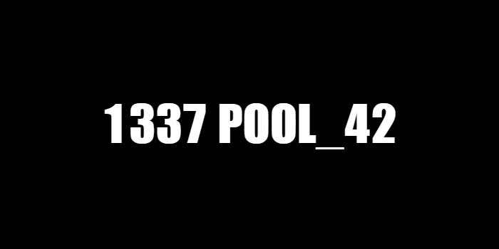

<h1 align="center">1337 POOL</h1>

 a month-long of socializing and working with your peers, where you'll discover your abilities. 

the purpose of 1337 is to challenge you to see if you're capable of learning by yourself and with your peers, it doesn't seek to teach you a language or two but the sole purpose is for you to discover the art of problem-solving.

during your pool, the week will be divided into three parts;

|Monday to Thursday | C days |
| ----------- | ----------- |
| Friday | EXAMS |
| the weekend | RUSH and BSQ |

1337 strives to produce men (women) who are capable of handling any task at hand.

## 1337 SCHOOL: 
    link: https://www.1337.ma/en/

  

